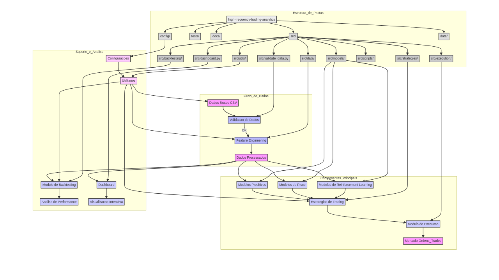

# 🚀 High-Frequency Trading Analytics

<!-- Badges Section -->
<div align="center">

[](https://github.com/galafis/high-frequency-trading-analytics/actions)
[](https://codecov.io/gh/galafis/high-frequency-trading-analytics)
[](https://github.com/galafis/high-frequency-trading-analytics/stargazers)
[](https://github.com/galafis/high-frequency-trading-analytics/network/members)
[](https://github.com/galafis/high-frequency-trading-analytics/watchers)
[](https://github.com/galafis/high-frequency-trading-analytics/blob/main/LICENSE)

[](https://www.python.org/)
[](https://pytorch.org/)
[](https://numpy.org/)
[](https://pandas.pydata.org/)
[](https://jupyter.org/)

<!-- Contribution Badges -->
[](https://github.com/galafis/high-frequency-trading-analytics/graphs/contributors)
[](https://github.com/galafis/high-frequency-trading-analytics/issues)
[](https://github.com/galafis/high-frequency-trading-analytics/pulls)
[](https://github.com/galafis/high-frequency-trading-analytics/commits/main)

</div>

---

## 🌟 Welcome to the Future of Quantitative Trading! | Bem-vindo ao Futuro do Trading Quantitativo!

### 🇺🇸 English

Are you passionate about financial markets and cutting-edge technology? You've found the perfect intersection! 🎯

This advanced high-frequency trading analytics platform combines machine learning, reinforcement learning, and market microstructure analysis to create automated trading strategies that adapt and evolve in real-time. It provides a robust and modular framework for research and implementation of HFT algorithms.

> **⭐ Love this project? Give it a star!** Your support motivates continued innovation and knowledge sharing with the quantitative finance community.

#### 🔥 Why Choose This Platform?

• 🧠 **AI-Powered**: Advanced reinforcement learning agents (DQN, PPO, A3C) that learn from market patterns
• ⚡ **Lightning Fast**: Microsecond-level execution optimization techniques for high-frequency strategies
• 📊 **Data-Driven**: Comprehensive quantitative analysis with statistical and econometric models
• 🎯 **Battle-Tested**: Robust backtesting framework with real market conditions
• 🔬 **Deep Market Insights**: Order book analysis and market impact modeling solutions
• ⚖️ **Smart Risk Management**: Real-time risk controls and position management systems

### 🇧🇷 Português

Você é apaixonado por mercados financeiros e tecnologia de ponta? Você encontrou a intersecção perfeita! 🎯

Esta plataforma avançada de análise de trading de alta frequência combina aprendizado de máquina, aprendizado por reforço e análise de microestrutura de mercado para criar estratégias de trading automatizadas que se adaptam e evoluem em tempo real. Ela oferece uma estrutura robusta e modular para pesquisa e implementação de algoritmos de HFT.

> **⭐ Gostou deste projeto? Dê uma estrela!** Seu apoio motiva a inovação contínua e o compartilhamento de conhecimento com a comunidade de finanças quantitativas.

---

## 📸 Hero Image | Imagem Hero

<div align="center">


</div>

---

## 📋 Overview | Visão Geral

### 🇺🇸 English

This repository presents a complete solution for data analysis and strategy development in **High-Frequency Trading (HFT)**. It covers everything from feature engineering and data validation to building predictive models, trading strategies, and an interactive dashboard for visualizing results. The goal is to provide a robust and modular framework for HFT algorithm research and implementation.

### 🇧🇷 Português

Este repositório apresenta uma solução completa para análise de dados e desenvolvimento de estratégias em **High-Frequency Trading (HFT)**. Ele abrange desde a engenharia de features e validação de dados até a construção de modelos preditivos, estratégias de negociação e um dashboard interativo para visualização de resultados. O objetivo é fornecer uma estrutura robusta e modular para pesquisa e implementação de algoritmos de HFT.

---

## ✨ Main Functionalities | Funcionalidades Principais

### 🇺🇸 English

- **Feature Engineering**: Pipeline for creating essential market features for HFT.
- **Data Validation**: Tools to ensure the integrity and correct format of input data.
- **Modeling**: Implementation of predictive, risk, and reinforcement learning models.
- **Trading Strategies**: Examples of strategies such as arbitrage, market making, and momentum.
- **Backtesting**: Module for simulating and evaluating strategy performance.
- **Interactive Dashboard**: Data and results visualization through a Streamlit application.
- **Modular Structure**: Clear and scalable code organization for easy maintenance and expansion.

### 🇧🇷 Português

- **Engenharia de Features**: Pipeline para criação de features de mercado essenciais para HFT.
- **Validação de Dados**: Ferramentas para garantir a integridade e o formato correto dos dados de entrada.
- **Modelagem**: Implementação de modelos preditivos, de risco e de aprendizado por reforço.
- **Estratégias de Trading**: Exemplos de estratégias como arbitragem, market making e momentum.
- **Backtesting**: Módulo para simulação e avaliação de performance de estratégias.
- **Dashboard Interativo**: Visualização de dados e resultados através de um aplicativo Streamlit.
- **Estrutura Modular**: Organização clara e escalável do código para fácil manutenção e expansão.

---

## 📁 Repository Structure | Estrutura do Repositório

```
high-frequency-trading-analytics/
├── config/                 # Project configuration files | Arquivos de configuração do projeto
├── docs/                   # Documentation, diagrams, and notebooks | Documentação, diagramas e notebooks
│   ├── architecture_diagram.md
│   ├── architecture_diagram.png
│   ├── data_README.md
│   ├── notebooks/          # Jupyter notebooks for exploration and prototyping | Notebooks Jupyter para exploração e prototipagem
│   ├── tests_README.md
│   └── PAIR_EXTRAORDINAIRE_ACHIEVEMENT.md # Achievement document | Documento de conquistas
├── src/                    # Main application source code | Código-fonte principal da aplicação
│   ├── backtesting/        # Strategy backtesting module | Módulo de backtesting de estratégias
│   ├── data/               # Data processing and engineering module | Módulo de processamento e engenharia de dados
│   ├── execution/          # Order execution and latency management module | Módulo de execução de ordens e gerenciamento de latência
│   ├── models/             # Model implementations (predictive, risk, RL) | Implementações de modelos (preditivos, risco, RL)
│   ├── scripts/            # Utility scripts | Scripts utilitários
│   ├── strategies/         # Trading strategy implementations | Implementações de estratégias de trading
│   ├── utils/              # Utility functions and helpers | Funções utilitárias e helpers
│   ├── dashboard.py        # Streamlit dashboard application | Aplicação Streamlit para dashboard
│   └── validate_data.py    # Data validation script | Script de validação de dados
├── tests/                  # Unit and integration tests | Testes unitários e de integração
├── .gitignore              # Files and folders to be ignored by Git | Arquivos e pastas a serem ignorados pelo Git
├── LICENSE                 # Project license | Licença do projeto

└── README.md               # This file | Este arquivo
```

---

## 🚀 Quick Start | Início Rápido

### 🇺🇸 English

### Prerequisites

Ensure you have Python 3.8+ installed. Using a virtual environment is recommended.

```bash
python -m venv venv
source venv/bin/activate  # On Windows use `venv\Scripts\activate`
pip install -r requirements.txt
```

### Data Validation

Before processing any data, you can validate it using the `validate_data.py` script:

```bash
python src/validate_data.py data/raw/your_data_file.csv
```

### Feature Engineering

To generate features from raw data, use the `features.py` script:

```bash
python src/data/features.py --input data/raw/your_data_file.csv --output_parquet data/processed/features.parquet --output_csv data/processed/features.csv
```

### Running the Dashboard

To visualize processed data and strategy performance, run the Streamlit dashboard:

```bash
streamlit run src/dashboard.py
```

### 🇧🇷 Português

### Pré-requisitos

Certifique-se de ter Python 3.8+ instalado. Recomenda-se o uso de um ambiente virtual.

```bash
python -m venv venv
source venv/bin/activate  # No Windows use `venv\Scripts\activate`
pip install -r requirements.txt
```

### Validação de Dados

Antes de processar qualquer dado, você pode validá-lo usando o script `validate_data.py`:

```bash
python src/validate_data.py data/raw/seu_arquivo_de_dados.csv
```

### Engenharia de Features

Para gerar features a partir de dados brutos, utilize o script `features.py`:

```bash
python src/data/features.py --input data/raw/seu_arquivo_de_dados.csv --output_parquet data/processed/features.parquet --output_csv data/processed/features.csv
```

### Executando o Dashboard

Para visualizar os dados processados e a performance das estratégias, execute o dashboard Streamlit:

```bash
streamlit run src/dashboard.py
```

---

## 📐 Architecture Diagram | Diagrama de Arquitetura

<div align="center">



</div>

---

## 🤝 Contribution | Contribuição

### 🇺🇸 English

Contributions are welcome! Please follow the contribution guidelines for this project.

### 🇧🇷 Português

Contribuições são bem-vindas! Por favor, siga as diretrizes de contribuição para este projeto.

---

## 📄 License | Licença

### 🇺🇸 English

This project is licensed under the MIT License. See the `LICENSE` file for more details.

### 🇧🇷 Português

Este projeto está licenciado sob a licença MIT. Veja o arquivo `LICENSE` para mais detalhes.

---

## 👤 Author | Autor

**Gabriel Demetrios Lafis**

---

## 📈 Project Status | Status do Projeto

- 🚧 **Active Development** | **Desenvolvimento Ativo**
- 🔄 **Regular Updates** | **Atualizações Regulares**
- 🌟 **Community Driven** | **Conduzido pela Comunidade**
- 📚 **Well Documented** | **Bem Documentado**

---

## 💬 Get in Touch | Entre em Contato

<div align="center">

**Found this project valuable? Don't forget to ⭐ star and 🍴 fork it!**

**Achou este projeto valioso? Não esqueça de dar ⭐ estrela e 🍴 fork!**

[](https://github.com/galafis)
[](https://twitter.com/galafis)

</div>

---

<div align="center">

**🌟 If this project helped you, please consider giving it a star! ⭐**

**🌟 Se este projeto te ajudou, por favor, considere dar uma estrela! ⭐**

*Made with ❤️ by Gabriel Demetrios Lafis*

</div>
