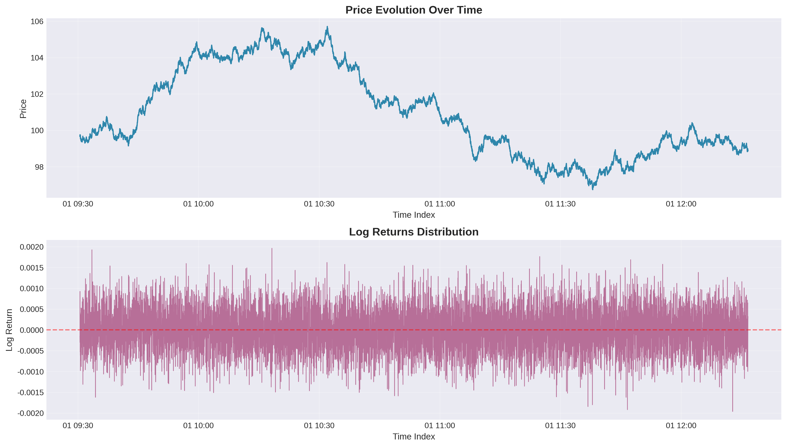
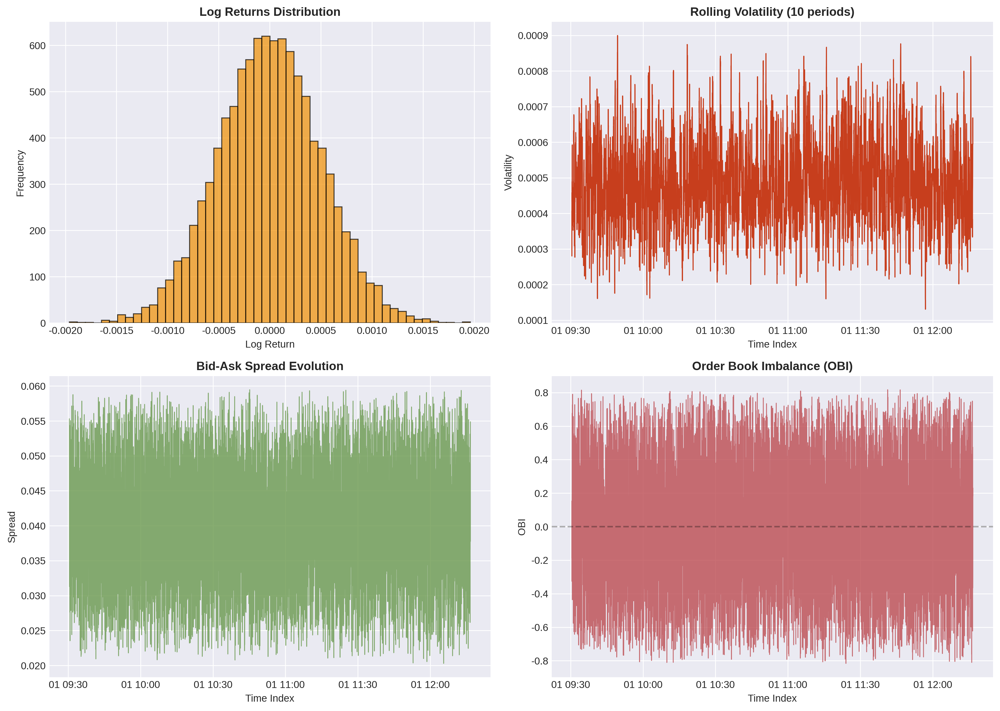
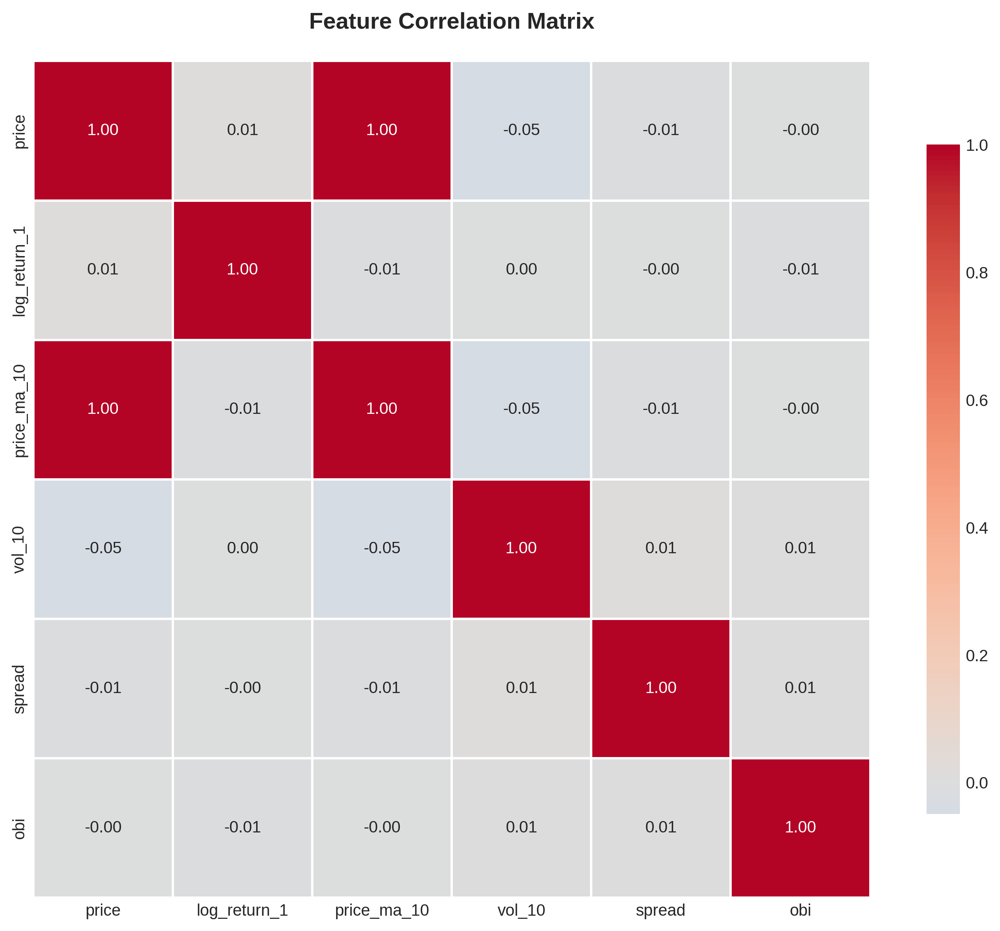
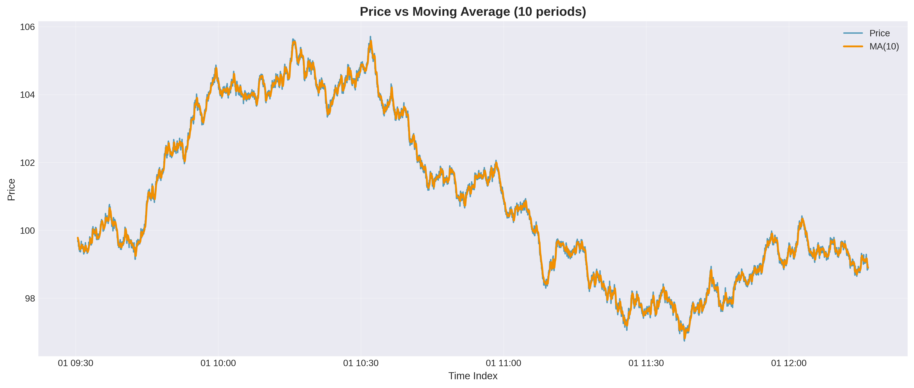
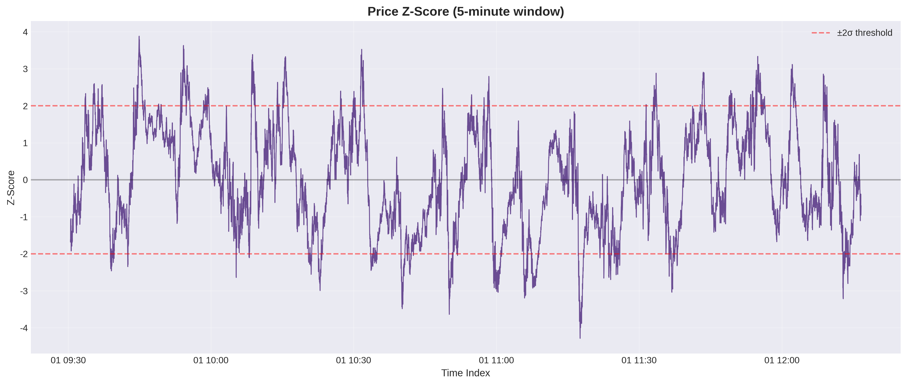

# 🚀 High-Frequency Trading Analytics

<!-- Badges Section -->
<div align="center">

[](https://github.com/galafis/high-frequency-trading-analytics/actions)
[](https://www.python.org/)
[](https://github.com/psf/black)
[](https://github.com/galafis/high-frequency-trading-analytics/blob/main/LICENSE)
[](https://github.com/galafis/high-frequency-trading-analytics/stargazers)

</div>

---

## 🌟 Welcome to the Future of Quantitative Trading! | Bem-vindo ao Futuro do Trading Quantitativo!

### 🇺🇸 English

This advanced high-frequency trading (HFT) analytics platform provides a robust and modular framework for the research, development, and implementation of sophisticated trading algorithms. It combines quantitative analysis, market microstructure, and data-driven insights to build and evaluate automated trading strategies.

> **⭐ Love this project? Give it a star!** Your support motivates continued innovation and knowledge sharing with the quantitative finance community.

### 🇧🇷 Português

Esta plataforma avançada de análise de trading de alta frequência (HFT) oferece uma estrutura robusta e modular para a pesquisa, desenvolvimento e implementação de algoritmos de negociação sofisticados. Ela combina análise quantitativa, microestrutura de mercado e insights baseados em dados para construir e avaliar estratégias de trading automatizadas.

> **⭐ Gostou deste projeto? Dê uma estrela!** Seu apoio motiva a inovação contínua e o compartilhamento de conhecimento com a comunidade de finanças quantitativas.

---

## 🖼️ Visual Analysis Showcase | Vitrine de Análise Visual

Visual analysis is crucial for understanding market dynamics and feature behavior. Below are some examples of visualizations generated by the platform, providing insights into price movements, volatility, and feature interactions.

<div align="center">

*Price Evolution and Log Returns*


*Key Feature Distributions*


*Feature Correlation Matrix*


*Price vs. 10-Period Moving Average*


*Price Z-Score Analysis (5-minute window)*


</div>

---

## ✨ Main Functionalities | Funcionalidades Principais

- **Feature Engineering**: A powerful pipeline to create essential market features for HFT, including lags, returns, moving averages, volatility, and order book imbalance (OBI).
- **Data Validation**: Tools to ensure the integrity and correct format of input data, crucial for reliable models.
- **Backtesting Engine**: A (conceptual) module for simulating and evaluating the performance of trading strategies against historical data.
- **Interactive Dashboard**: A Streamlit application for visualizing raw data, engineered features, and model results.
- **Modular Structure**: Clean, scalable, and well-organized code designed for easy maintenance and expansion.

---

## 📁 Repository Structure | Estrutura do Repositório

```
high-frequency-trading-analytics/
├── .github/workflows/      # CI/CD workflows for automated testing
│   └── test_features.yml
├── config/                 # Project configuration files
│   ├── config.py
│   └── config.yaml
├── data/
│   ├── processed/          # Processed data and engineered features
│   └── raw/                # Raw market data
├── docs/
│   ├── images/             # Generated charts and visualizations
│   └── ...                 # Other documentation files
├── logs/                   # Directory for log files
├── scripts/                # Utility and automation scripts
│   └── generate_visualizations.py
├── src/                    # Main application source code
│   ├── __init__.py
│   ├── backtesting/        # Strategy backtesting module
│   ├── data/               # Data processing and feature engineering
│   ├── execution/          # Order execution and latency management
│   ├── models/             # Predictive, risk, and RL models
│   ├── strategies/         # Trading strategy implementations
│   ├── utils/              # Utility functions and helpers
│   ├── dashboard.py        # Streamlit dashboard application
│   └── validate_data.py    # Data validation script
├── tests/                  # Unit and integration tests
│   ├── __init__.py
│   ├── test_features.py
│   └── test_validate_data.py
├── README.md               # This file
└── requirements.txt        # Project dependencies
```

---

## 🚀 Quick Start | Início Rápido

### Prerequisites

Ensure you have Python 3.8+ installed. Using a virtual environment is highly recommended.

```bash
# 1. Clone the repository
git clone https://github.com/galafis/high-frequency-trading-analytics.git
cd high-frequency-trading-analytics

# 2. Create and activate a virtual environment
python -m venv venv
source venv/bin/activate  # On Windows use `venv\Scripts\activate`

# 3. Install dependencies
pip install --upgrade pip
pip install -r requirements.txt
```

### Running the Platform

```bash
# 1. Generate sample data (optional, sample data is already included)
# The script used to generate the current sample_data.csv is available for reference.

# 2. Run the feature engineering pipeline
python src/data/features.py --input data/raw/sample_data.csv --output_parquet data/processed/features.parquet --output_csv data/processed/features.csv

# 3. Run the interactive dashboard
streamlit run src/dashboard.py

# 4. Run tests to ensure everything is working correctly
pytest
```

---

## 📐 Architecture Diagram | Diagrama de Arquitetura

<div align="center">


</div>

---

## 🤝 Contribution | Contribuição

Contributions are welcome! Please follow the contribution guidelines for this project. Feel free to open an issue or submit a pull request.

---

## 📄 License | Licença

This project is licensed under the MIT License. See the `LICENSE` file for more details.

---

## 👤 Author | Autor

**Gabriel Demetrios Lafis**

---

<div align="center">

*Made with ❤️ by Gabriel Demetrios Lafis*

</div>

