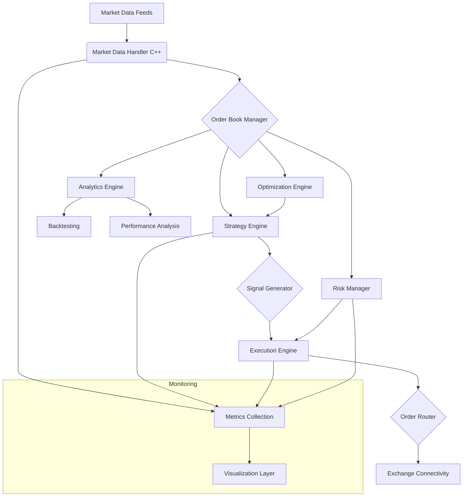

# 🇧🇷 Sistema de Trading de Alta Frequência e Analytics


Um sistema completo de trading de alta frequência e análise quantitativa, combinando algoritmos de ultra-baixa latência em C++ com modelos avançados de machine learning em Python e computação numérica de alta performance em Julia. Este projeto implementa estratégias de market making, arbitragem estatística e análise de microestrutura de mercado com foco em performance e precisão.

## 📋 Índice

- [Visão Geral](#visão-geral)
- [Funcionalidades](#funcionalidades)
- [Tecnologias Utilizadas](#tecnologias-utilizadas)
- [Arquitetura](#arquitetura)
- [Estrutura do Projeto](#estrutura-do-projeto)
- [Instalação](#instalação)
- [Uso](#uso)
- [Estratégias Implementadas](#estratégias-implementadas)
- [Backtesting](#backtesting)
- [Otimização](#otimização)
- [Análise de Performance](#análise-de-performance)
- [Contribuição](#contribuição)
- [Licença](#licença)
- [Contato](#contato)

## 🔍 Visão Geral

Este projeto implementa um sistema completo de trading de alta frequência (HFT) e análise quantitativa, projetado para operar em mercados financeiros com latência ultra-baixa (<1ms) e alta precisão. O sistema combina algoritmos de execução de alta performance escritos em C++ com modelos avançados de machine learning em Python e computação numérica de alta performance em Julia.

O sistema é capaz de processar e reagir a dados de mercado em tempo real, implementar diversas estratégias de trading algorítmico, realizar backtesting com dados históricos de alta frequência, otimizar parâmetros de estratégias e analisar a performance das operações.

## ✨ Funcionalidades

- **Trading de Ultra-Baixa Latência**: Processamento de dados de mercado e execução de ordens com latência <1ms.
- **Estratégias Avançadas**: Market making, arbitragem estatística, análise de microestrutura de mercado.
- **Reinforcement Learning**: Algoritmos de RL (DQN, PPO, A3C) para otimização de execução e market making.
- **Backtesting de Alta Fidelidade**: Simulação precisa de mercado com dados de nível 2 (order book).
- **Análise de Microestrutura**: Modelagem de impacto de mercado, spread efetivo, toxicidade de fluxo.
- **Otimização de Parâmetros**: Algoritmos genéticos e bayesianos para otimização de estratégias.
- **Análise de Risco**: Cálculo de VaR, Expected Shortfall, stress testing em tempo real.
- **Visualização Avançada**: Dashboards interativos para monitoramento de estratégias e análise de performance.

## 🛠️ Tecnologias Utilizadas

### Linguagens de Programação
- **C++**: Componentes de baixa latência, processamento de market data, execução de ordens.
- **Python**: Modelos de ML, backtesting, análise de dados, visualização.
- **Julia**: Computação numérica de alta performance, otimização, simulação.

### Frameworks e Bibliotecas
- **C++**:
  - Boost, ZeroMQ, FlatBuffers para comunicação de baixa latência
  - DPDK para processamento de rede otimizado
  - Eigen para álgebra linear de alta performance
  - OpenMP/TBB para paralelização

- **Python**:
  - NumPy, Pandas, SciPy para análise de dados
  - PyTorch, TensorFlow para modelos de ML/RL
  - Numba para aceleração de código Python
  - Plotly, Dash para visualização interativa

- **Julia**:
  - JuMP para otimização matemática
  - DifferentialEquations.jl para modelagem estocástica
  - QuantLib.jl para modelagem financeira
  - Flux.jl para deep learning

### Infraestrutura
- **Hardware Especializado**: Suporte para FPGA, GPU, e CPU de baixa latência
- **Armazenamento de Dados**: InfluxDB para séries temporais, ClickHouse para análise
- **Comunicação**: Protocolos FIX/FAST, multicast UDP, IPC de baixa latência
- **Monitoramento**: Prometheus, Grafana para métricas em tempo real

## 🏗️ Arquitetura

O sistema segue uma arquitetura modular de baixo acoplamento, com componentes especializados para diferentes aspectos do trading de alta frequência:

1. **Market Data Handler (C++)**: Processa feeds de dados de mercado em tempo real com latência ultra-baixa.
2. **Strategy Engine (C++/Python)**: Implementa lógica de trading e gera sinais.
3. **Execution Engine (C++)**: Gerencia a execução de ordens com otimização de latência.
4. **Risk Manager (C++/Python)**: Monitora e controla exposição ao risco em tempo real.
5. **Analytics Engine (Python/Julia)**: Realiza análises quantitativas e backtesting.
6. **Optimization Engine (Julia)**: Otimiza parâmetros de estratégias.
7. **Visualization Layer (Python)**: Dashboards para monitoramento e análise.



## 📁 Estrutura do Projeto

```
high-frequency-trading-analytics/
├── src/
│   ├── models/                # Modelos de ML/RL para previsão e execução
│   ├── strategies/            # Implementações de estratégias de trading
│   ├── data/                  # Processamento e gerenciamento de dados
│   ├── backtesting/           # Framework de backtesting
│   ├── optimization/          # Algoritmos de otimização de parâmetros
│   ├── execution/             # Componentes de execução de ordens
│   └── visualization/         # Dashboards e visualizações
├── cpp/                       # Código C++ para componentes de baixa latência
│   ├── market_data/           # Processamento de dados de mercado
│   ├── order_book/            # Implementação de order book
│   ├── execution/             # Engine de execução
│   └── risk/                  # Gerenciamento de risco
├── julia/                     # Código Julia para computação de alta performance
│   ├── optimization/          # Otimização de parâmetros
│   ├── simulation/            # Simulação de mercado
│   └── models/                # Modelos quantitativos
├── scripts/                   # Scripts utilitários
├── config/                    # Arquivos de configuração
├── data/                      # Dados de exemplo e datasets
├── docs/                      # Documentação adicional
├── tests/                     # Testes automatizados
├── requirements.txt           # Dependências Python
└── README.md                  # Este arquivo
```

## 🚀 Instalação

### Pré-requisitos
- C++17 ou superior com compilador compatível (GCC 9+, Clang 10+)
- Python 3.8+
- Julia 1.6+
- CMake 3.15+
- Boost 1.70+
- ZeroMQ 4.3+
- CUDA 11+ (opcional, para aceleração GPU)

### Instalação

```bash
# Clone o repositório
git clone https://github.com/galafis/high-frequency-trading-analytics.git
cd high-frequency-trading-analytics

# Compilar componentes C++
mkdir -p cpp/build && cd cpp/build
cmake ..
make -j$(nproc)
cd ../..

# Instalar dependências Python
python -m venv venv
source venv/bin/activate  # Linux/macOS
# venv\Scripts\activate  # Windows
pip install -r requirements.txt

# Instalar pacotes Julia
julia -e 'using Pkg; Pkg.activate("."); Pkg.instantiate()'
```

## 📊 Uso

### Executando o Sistema Completo

```bash
# Iniciar o sistema completo (modo simulação)
python scripts/run_system.py --mode simulation --config config/simulation.yaml

# Iniciar o sistema completo (modo produção)
python scripts/run_system.py --mode production --config config/production.yaml
```

### Executando Componentes Individuais

```bash
# Executar apenas o processador de market data
./cpp/build/bin/market_data_processor --config config/market_data.yaml

# Executar uma estratégia específica
python src/strategies/run_strategy.py --strategy stat_arb --config config/strategies/stat_arb.yaml

# Executar backtesting
python src/backtesting/run_backtest.py --strategy market_making --data data/historical/btcusdt_202506.parquet --config config/backtest.yaml

# Executar otimização de parâmetros
julia julia/optimization/optimize_strategy.jl --strategy market_making --config config/optimization.yaml
```

## 🧠 Estratégias Implementadas

### Market Making
- **Avellaneda-Stoikov**: Implementação do modelo clássico de market making com ajuste dinâmico de spread.
- **RL-based Market Making**: Market making baseado em reinforcement learning (DQN, PPO).
- **Adaptive Market Making**: Ajuste de parâmetros baseado em volatilidade e fluxo de ordens.

### Arbitragem Estatística
- **Pairs Trading**: Trading de pares com cointegração e reversão à média.
- **Statistical Factor Models**: Modelos de fatores para arbitragem estatística multi-ativo.
- **Kalman Filter**: Estimação dinâmica de parâmetros para trading de pares.

### Microestrutura de Mercado
- **Order Flow Imbalance**: Previsão de movimentos de preço baseada em desequilíbrio de fluxo de ordens.
- **Liquidity Provision**: Estratégias de provisão de liquidez com gerenciamento de inventário.
- **Latency Arbitrage**: Exploração de diferenças de latência entre venues.

## 📈 Backtesting

O framework de backtesting suporta:

- **Simulação de Order Book**: Reconstrução completa do order book para backtesting de alta fidelidade.
- **Modelagem de Latência**: Simulação realista de latências de rede e execução.
- **Impacto de Mercado**: Modelagem do impacto de ordens no mercado.
- **Custos de Transação**: Inclusão de spreads, taxas e slippage.
- **Análise de Performance**: Métricas detalhadas de performance (Sharpe, Sortino, drawdown, etc.).

```python
# Exemplo de código para backtesting
from src.backtesting import Backtest
from src.strategies import MarketMakingStrategy
from src.data import OrderBookDataLoader

# Carregar dados históricos de order book
data_loader = OrderBookDataLoader("data/historical/btcusdt_level2_202506.parquet")
order_book_data = data_loader.load()

# Configurar estratégia
strategy = MarketMakingStrategy(
    spread_factor=0.002,
    inventory_limit=10,
    risk_aversion=0.9
)

# Executar backtest
backtest = Backtest(
    strategy=strategy,
    data=order_book_data,
    commission=0.0002,
    slippage=0.0001
)

# Analisar resultados
results = backtest.run()
results.plot_equity_curve()
results.print_metrics()
```

## 🔧 Otimização

O sistema inclui ferramentas avançadas para otimização de parâmetros:

- **Algoritmos Genéticos**: Otimização evolutiva de parâmetros de estratégias.
- **Bayesian Optimization**: Otimização bayesiana para exploração eficiente do espaço de parâmetros.
- **Grid/Random Search**: Métodos tradicionais de busca de parâmetros.
- **Walk-Forward Analysis**: Validação de parâmetros em janelas temporais sucessivas.

```julia
# Exemplo de código Julia para otimização
using JuMP, Ipopt, DataFrames

# Definir função objetivo (Sharpe ratio)
function objective(params)
    # Executar backtest com os parâmetros
    results = run_backtest(
        strategy="market_making",
        spread_factor=params[1],
        inventory_limit=params[2],
        risk_aversion=params[3]
    )
    return -results.sharpe_ratio  # Negativo porque queremos maximizar
end

# Configurar otimização
model = Model(Ipopt.Optimizer)
@variable(model, 0.0001 <= spread_factor <= 0.01)
@variable(model, 1 <= inventory_limit <= 50)
@variable(model, 0.1 <= risk_aversion <= 2.0)

# Definir função objetivo
register(model, :objective, 3, objective, autodiff=true)
@NLobjective(model, Min, objective(spread_factor, inventory_limit, risk_aversion))

# Executar otimização
optimize!(model)

# Obter parâmetros ótimos
optimal_params = [
    value(spread_factor),
    value(inventory_limit),
    value(risk_aversion)
]
println("Parâmetros ótimos: ", optimal_params)
```

## 📊 Análise de Performance

O sistema fornece análise detalhada de performance:

- **Métricas de Trading**: Sharpe, Sortino, Calmar, drawdown, win rate, profit factor.
- **Análise de Execução**: VWAP, implementation shortfall, market impact.
- **Análise de Risco**: VaR, Expected Shortfall, stress testing.
- **Visualizações**: Equity curves, drawdown charts, trade distributions.

```python
# Exemplo de código para análise de performance
from src.analytics import PerformanceAnalyzer

# Carregar resultados de trading
results = PerformanceAnalyzer.load_results("results/market_making_202506.csv")

# Calcular métricas
metrics = results.calculate_metrics()
print(f"Sharpe Ratio: {metrics.sharpe_ratio:.2f}")
print(f"Max Drawdown: {metrics.max_drawdown:.2%}")
print(f"Win Rate: {metrics.win_rate:.2%}")

# Visualizar resultados
results.plot_equity_curve()
results.plot_drawdown()
results.plot_trade_distribution()
results.plot_pnl_by_hour()
```

## 👥 Contribuição

Contribuições são bem-vindas! Por favor, sinta-se à vontade para enviar pull requests, criar issues ou sugerir melhorias.

1. Faça um fork do projeto
2. Crie sua branch de feature (`git checkout -b feature/amazing-feature`)
3. Commit suas mudanças (`git commit -m 'Add some amazing feature'`)
4. Push para a branch (`git push origin feature/amazing-feature`)
5. Abra um Pull Request

## 📄 Licença

Este projeto está licenciado sob a licença MIT - veja o arquivo [LICENSE](LICENSE) para detalhes.

## 📞 Contato

Gabriel Demetrios Lafis - [GitHub](https://github.com/galafis)

Link do projeto: [https://github.com/galafis/high-frequency-trading-analytics](https://github.com/galafis/high-frequency-trading-analytics)

---

# 🇬🇧 High-Frequency Trading Analytics System


A complete high-frequency trading and quantitative analysis system, combining ultra-low latency algorithms in C++ with advanced machine learning models in Python and high-performance numerical computing in Julia. This project implements market making strategies, statistical arbitrage, and market microstructure analysis with a focus on performance and accuracy.

## 📋 Table of Contents

- [Overview](#overview)
- [Features](#features)
- [Technologies Used](#technologies-used)
- [Architecture](#architecture)
- [Project Structure](#project-structure)
- [Installation](#installation)
- [Usage](#usage)
- [Implemented Strategies](#implemented-strategies)
- [Backtesting](#backtesting)
- [Optimization](#optimization)
- [Performance Analysis](#performance-analysis)
- [Contributing](#contributing)
- [License](#license)
- [Contact](#contact)

## 🔍 Overview

This project implements a complete high-frequency trading (HFT) and quantitative analysis system, designed to operate in financial markets with ultra-low latency (<1ms) and high precision. The system combines high-performance execution algorithms written in C++ with advanced machine learning models in Python and high-performance numerical computing in Julia.

The system is capable of processing and reacting to market data in real-time, implementing various algorithmic trading strategies, performing backtesting with high-frequency historical data, optimizing strategy parameters, and analyzing trading performance.

## ✨ Features

- **Ultra-Low Latency Trading**: Market data processing and order execution with <1ms latency.
- **Advanced Strategies**: Market making, statistical arbitrage, market microstructure analysis.
- **Reinforcement Learning**: RL algorithms (DQN, PPO, A3C) for execution optimization and market making.
- **High-Fidelity Backtesting**: Accurate market simulation with level 2 (order book) data.
- **Microstructure Analysis**: Market impact modeling, effective spread, flow toxicity.
- **Parameter Optimization**: Genetic and Bayesian algorithms for strategy optimization.
- **Risk Analysis**: Real-time VaR, Expected Shortfall, stress testing.
- **Advanced Visualization**: Interactive dashboards for strategy monitoring and performance analysis.

## 🛠️ Technologies Used

### Programming Languages
- **C++**: Low-latency components, market data processing, order execution.
- **Python**: ML models, backtesting, data analysis, visualization.
- **Julia**: High-performance numerical computing, optimization, simulation.

### Frameworks and Libraries
- **C++**:
  - Boost, ZeroMQ, FlatBuffers for low-latency communication
  - DPDK for optimized network processing
  - Eigen for high-performance linear algebra
  - OpenMP/TBB for parallelization

- **Python**:
  - NumPy, Pandas, SciPy for data analysis
  - PyTorch, TensorFlow for ML/RL models
  - Numba for Python code acceleration
  - Plotly, Dash for interactive visualization

- **Julia**:
  - JuMP for mathematical optimization
  - DifferentialEquations.jl for stochastic modeling
  - QuantLib.jl for financial modeling
  - Flux.jl for deep learning

### Infrastructure
- **Specialized Hardware**: Support for FPGA, GPU, and low-latency CPU
- **Data Storage**: InfluxDB for time series, ClickHouse for analytics
- **Communication**: FIX/FAST protocols, multicast UDP, low-latency IPC
- **Monitoring**: Prometheus, Grafana for real-time metrics

## 🏗️ Architecture

The system follows a modular, loosely coupled architecture, with specialized components for different aspects of high-frequency trading:

1. **Market Data Handler (C++)**: Processes real-time market data feeds with ultra-low latency.
2. **Strategy Engine (C++/Python)**: Implements trading logic and generates signals.
3. **Execution Engine (C++)**: Manages order execution with latency optimization.
4. **Risk Manager (C++/Python)**: Monitors and controls risk exposure in real-time.
5. **Analytics Engine (Python/Julia)**: Performs quantitative analysis and backtesting.
6. **Optimization Engine (Julia)**: Optimizes strategy parameters.
7. **Visualization Layer (Python)**: Dashboards for monitoring and analysis.


## 📁 Project Structure

```
high-frequency-trading-analytics/
├── src/
│   ├── models/                # ML/RL models for prediction and execution
│   ├── strategies/            # Trading strategy implementations
│   ├── data/                  # Data processing and management
│   ├── backtesting/           # Backtesting framework
│   ├── optimization/          # Parameter optimization algorithms
│   ├── execution/             # Order execution components
│   └── visualization/         # Dashboards and visualizations
├── cpp/                       # C++ code for low-latency components
│   ├── market_data/           # Market data processing
│   ├── order_book/            # Order book implementation
│   ├── execution/             # Execution engine
│   └── risk/                  # Risk management
├── julia/                     # Julia code for high-performance computing
│   ├── optimization/          # Parameter optimization
│   ├── simulation/            # Market simulation
│   └── models/                # Quantitative models
├── scripts/                   # Utility scripts
├── config/                    # Configuration files
├── data/                      # Example data and datasets
├── docs/                      # Additional documentation
├── tests/                     # Automated tests
├── requirements.txt           # Python dependencies
└── README.md                  # This file
```

## 🚀 Installation

### Prerequisites
- C++17 or higher with compatible compiler (GCC 9+, Clang 10+)
- Python 3.8+
- Julia 1.6+
- CMake 3.15+
- Boost 1.70+
- ZeroMQ 4.3+
- CUDA 11+ (optional, for GPU acceleration)

### Installation

```bash
# Clone the repository
git clone https://github.com/galafis/high-frequency-trading-analytics.git
cd high-frequency-trading-analytics

# Compile C++ components
mkdir -p cpp/build && cd cpp/build
cmake ..
make -j$(nproc)
cd ../..

# Install Python dependencies
python -m venv venv
source venv/bin/activate  # Linux/macOS
# venv\Scripts\activate  # Windows
pip install -r requirements.txt

# Install Julia packages
julia -e 'using Pkg; Pkg.activate("."); Pkg.instantiate()'
```

## 📊 Usage

### Running the Complete System

```bash
# Start the complete system (simulation mode)
python scripts/run_system.py --mode simulation --config config/simulation.yaml

# Start the complete system (production mode)
python scripts/run_system.py --mode production --config config/production.yaml
```

### Running Individual Components

```bash
# Run only the market data processor
./cpp/build/bin/market_data_processor --config config/market_data.yaml

# Run a specific strategy
python src/strategies/run_strategy.py --strategy stat_arb --config config/strategies/stat_arb.yaml

# Run backtesting
python src/backtesting/run_backtest.py --strategy market_making --data data/historical/btcusdt_202506.parquet --config config/backtest.yaml

# Run parameter optimization
julia julia/optimization/optimize_strategy.jl --strategy market_making --config config/optimization.yaml
```

## 🧠 Implemented Strategies

### Market Making
- **Avellaneda-Stoikov**: Implementation of the classic market making model with dynamic spread adjustment.
- **RL-based Market Making**: Reinforcement learning-based market making (DQN, PPO).
- **Adaptive Market Making**: Parameter adjustment based on volatility and order flow.

### Statistical Arbitrage
- **Pairs Trading**: Cointegration-based pairs trading with mean reversion.
- **Statistical Factor Models**: Factor models for multi-asset statistical arbitrage.
- **Kalman Filter**: Dynamic parameter estimation for pairs trading.

### Market Microstructure
- **Order Flow Imbalance**: Price movement prediction based on order flow imbalance.
- **Liquidity Provision**: Liquidity provision strategies with inventory management.
- **Latency Arbitrage**: Exploitation of latency differences between venues.

## 📈 Backtesting

The backtesting framework supports:

- **Order Book Simulation**: Complete order book reconstruction for high-fidelity backtesting.
- **Latency Modeling**: Realistic simulation of network and execution latencies.
- **Market Impact**: Modeling of order impact on the market.
- **Transaction Costs**: Inclusion of spreads, fees, and slippage.
- **Performance Analysis**: Detailed performance metrics (Sharpe, Sortino, drawdown, etc.).

```python
# Example code for backtesting
from src.backtesting import Backtest
from src.strategies import MarketMakingStrategy
from src.data import OrderBookDataLoader

# Load historical order book data
data_loader = OrderBookDataLoader("data/historical/btcusdt_level2_202506.parquet")
order_book_data = data_loader.load()

# Configure strategy
strategy = MarketMakingStrategy(
    spread_factor=0.002,
    inventory_limit=10,
    risk_aversion=0.9
)

# Run backtest
backtest = Backtest(
    strategy=strategy,
    data=order_book_data,
    commission=0.0002,
    slippage=0.0001
)

# Analyze results
results = backtest.run()
results.plot_equity_curve()
results.print_metrics()
```

## 🔧 Optimization

The system includes advanced tools for parameter optimization:

- **Genetic Algorithms**: Evolutionary optimization of strategy parameters.
- **Bayesian Optimization**: Bayesian optimization for efficient parameter space exploration.
- **Grid/Random Search**: Traditional parameter search methods.
- **Walk-Forward Analysis**: Parameter validation across successive time windows.

```julia
# Example Julia code for optimization
using JuMP, Ipopt, DataFrames

# Define objective function (Sharpe ratio)
function objective(params)
    # Run backtest with parameters
    results = run_backtest(
        strategy="market_making",
        spread_factor=params[1],
        inventory_limit=params[2],
        risk_aversion=params[3]
    )
    return -results.sharpe_ratio  # Negative because we want to maximize
end

# Set up optimization
model = Model(Ipopt.Optimizer)
@variable(model, 0.0001 <= spread_factor <= 0.01)
@variable(model, 1 <= inventory_limit <= 50)
@variable(model, 0.1 <= risk_aversion <= 2.0)

# Define objective function
register(model, :objective, 3, objective, autodiff=true)
@NLobjective(model, Min, objective(spread_factor, inventory_limit, risk_aversion))

# Run optimization
optimize!(model)

# Get optimal parameters
optimal_params = [
    value(spread_factor),
    value(inventory_limit),
    value(risk_aversion)
]
println("Optimal parameters: ", optimal_params)
```

## 📊 Performance Analysis

The system provides detailed performance analysis:

- **Trading Metrics**: Sharpe, Sortino, Calmar, drawdown, win rate, profit factor.
- **Execution Analysis**: VWAP, implementation shortfall, market impact.
- **Risk Analysis**: VaR, Expected Shortfall, stress testing.
- **Visualizations**: Equity curves, drawdown charts, trade distributions.

```python
# Example code for performance analysis
from src.analytics import PerformanceAnalyzer

# Load trading results
results = PerformanceAnalyzer.load_results("results/market_making_202506.csv")

# Calculate metrics
metrics = results.calculate_metrics()
print(f"Sharpe Ratio: {metrics.sharpe_ratio:.2f}")
print(f"Max Drawdown: {metrics.max_drawdown:.2%}")
print(f"Win Rate: {metrics.win_rate:.2%}")

# Visualize results
results.plot_equity_curve()
results.plot_drawdown()
results.plot_trade_distribution()
results.plot_pnl_by_hour()
```

## 👥 Contributing

Contributions are welcome! Please feel free to submit pull requests, create issues, or suggest improvements.

1. Fork the project
2. Create your feature branch (`git checkout -b feature/amazing-feature`)
3. Commit your changes (`git commit -m 'Add some amazing feature'`)
4. Push to the branch (`git push origin feature/amazing-feature`)
5. Open a Pull Request

## 📄 License

This project is licensed under the MIT License - see the [LICENSE](LICENSE) file for details.

## 📞 Contact

Gabriel Demetrios Lafis - [GitHub](https://github.com/galafis)

Project Link: [https://github.com/galafis/high-frequency-trading-analytics](https://github.com/galafis/high-frequency-trading-analytics)

