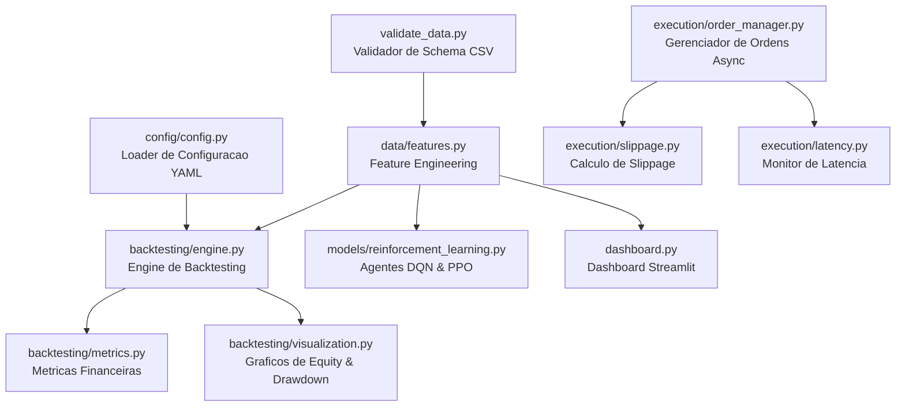
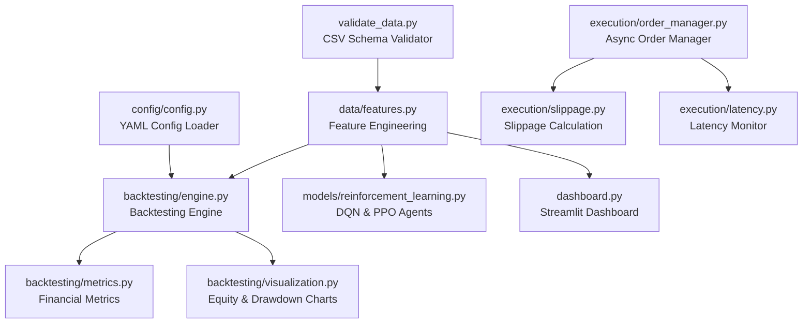

# High-Frequency Trading Analytics

Ferramentas para analise de trading de alta frequencia: backtesting, feature engineering, monitoramento de latencia, gerenciamento de ordens e aprendizado por reforco (DQN/PPO).

[](https://python.org)
[](https://pytorch.org)
[](LICENSE)
[](Dockerfile)

[Portugues](#portugues) | [English](#english)

---

## Portugues

### Sobre

Conjunto de modulos Python para analise e simulacao de estrategias de trading de alta frequencia. Inclui um engine de backtesting, pipeline de feature engineering, monitoramento de latencia, gerenciador de ordens assincrono, agentes de aprendizado por reforco (DQN e PPO) e um dashboard Streamlit para visualizacao.

**Nota**: Este e um projeto de estudo/prototipacao. Os agentes de RL treinam em ambientes sinteticos (gymnasium) e o gerenciador de ordens simula execucoes — nao ha integracao com corretoras reais.

### Modulos

| Modulo | Descricao |
|--------|-----------|
| `src/backtesting/engine.py` | Engine de backtesting com suporte a multiplas estrategias, comissao e calculo de P&L |
| `src/backtesting/metrics.py` | Metricas financeiras: Sharpe, Sortino, max drawdown, CAGR, calmar ratio |
| `src/backtesting/visualization.py` | Graficos de equity curve, drawdown e distribuicao de retornos (matplotlib) |
| `src/backtesting/logger.py` | Logger configuravel para o backtesting |
| `src/data/features.py` | Pipeline de feature engineering: lag, media movel, log returns, z-score, exportacao CSV/Parquet |
| `src/execution/latency.py` | Monitor de latencia com percentis (p95/p99), profiler e benchmarks |
| `src/execution/order_manager.py` | Gerenciador de ordens assincrono com validacao de risco, limites de posicao e loss diario |
| `src/execution/slippage.py` | Calculo de slippage para simulacao de execucao |
| `src/models/reinforcement_learning.py` | Agentes DQN e PPO com PyTorch, ambientes gymnasium para trading e market making |
| `src/scripts/validate_models.py` | Script de validacao cruzada dos modelos de RL com dados sinteticos |
| `src/dashboard.py` | Dashboard Streamlit para visualizacao interativa de features processadas |
| `src/validate_data.py` | Validador de schema CSV (colunas obrigatorias, tipos, valores nulos) |
| `config/` | Configuracao YAML com parametros de trading, dados e modelos |

### Arquitetura


```mermaid
graph TD
    CFG["config/config.py<br/>Loader de Configuracao YAML"] --> ENG
    VD["validate_data.py<br/>Validador de Schema CSV"] --> FE
    FE["data/features.py<br/>Feature Engineering"] --> ENG["backtesting/engine.py<br/>Engine de Backtesting"]
    ENG --> MET["backtesting/metrics.py<br/>Metricas Financeiras"]
    ENG --> VIS["backtesting/visualization.py<br/>Graficos de Equity & Drawdown"]
    FE --> RL["models/reinforcement_learning.py<br/>Agentes DQN & PPO"]
    OM["execution/order_manager.py<br/>Gerenciador de Ordens Async"] --> SL["execution/slippage.py<br/>Calculo de Slippage"]
    OM --> LAT["execution/latency.py<br/>Monitor de Latencia"]
    FE --> DASH["dashboard.py<br/>Dashboard Streamlit"]
```

### Estrutura

```
high-frequency-trading-analytics/
├── config/
│   ├── config.py              # Loader de configuracao (YAML/JSON/env)
│   └── config.yaml            # Parametros de trading e dados
├── src/
│   ├── backtesting/
│   │   ├── engine.py          # Engine de backtesting
│   │   ├── metrics.py         # Metricas financeiras
│   │   ├── visualization.py   # Graficos matplotlib
│   │   └── logger.py          # Logger do backtesting
│   ├── data/
│   │   └── features.py        # Feature engineering pipeline
│   ├── execution/
│   │   ├── latency.py         # Monitor/profiler de latencia
│   │   ├── order_manager.py   # Gerenciador de ordens async
│   │   └── slippage.py        # Calculo de slippage
│   ├── models/
│   │   └── reinforcement_learning.py  # DQN + PPO (PyTorch)
│   ├── scripts/
│   │   └── validate_models.py # Validacao cruzada de modelos
│   ├── utils/
│   │   ├── helpers.py         # Funcoes utilitarias
│   │   └── logger.py          # Logger com rotacao e cores
│   ├── dashboard.py           # Dashboard Streamlit
│   └── validate_data.py       # Validador de schema CSV
├── tests/
│   ├── test_features.py       # 12 testes para feature engineering
│   └── test_validate_data.py  # 9 testes para validacao de dados
├── requirements.txt
├── LICENSE
└── README.md
```

### Como Usar

```bash
# Clonar e instalar
git clone https://github.com/galafis/high-frequency-trading-analytics.git
cd high-frequency-trading-analytics
python -m venv venv
source venv/bin/activate  # Windows: venv\Scripts\activate
pip install -r requirements.txt

# Feature engineering (CLI)
python -m src.data.features --input data.csv --output features.parquet

# Dashboard Streamlit
streamlit run src/dashboard.py

# Validar dados CSV
python src/validate_data.py --input data.csv

# Validar modelos de RL
python src/scripts/validate_models.py --model dqn --periods 10

# Testes
pytest tests/ -v
```

### Tecnologias

| Tecnologia | Uso |
|------------|-----|
| **PyTorch** | Agentes DQN e PPO |
| **gymnasium** | Ambientes de simulacao para RL |
| **pandas** | Manipulacao de dados e feature engineering |
| **NumPy** | Operacoes numericas |
| **SciPy** | Calculo de p-values e distribuicoes |
| **matplotlib** | Graficos de backtesting |
| **Plotly** | Graficos interativos no dashboard |
| **Streamlit** | Dashboard web interativo |

---

## English

### About

Collection of Python modules for high-frequency trading analysis and simulation. Includes a backtesting engine, feature engineering pipeline, latency monitoring, async order manager, reinforcement learning agents (DQN and PPO), and a Streamlit dashboard for visualization.

**Note**: This is a study/prototyping project. RL agents train on synthetic environments (gymnasium) and the order manager simulates executions — there is no integration with real brokers.

### Modules

| Module | Description |
|--------|-------------|
| `src/backtesting/engine.py` | Backtesting engine with multi-strategy support, commission, and P&L calculation |
| `src/backtesting/metrics.py` | Financial metrics: Sharpe, Sortino, max drawdown, CAGR, calmar ratio |
| `src/backtesting/visualization.py` | Equity curve, drawdown, and return distribution charts (matplotlib) |
| `src/backtesting/logger.py` | Configurable backtesting logger |
| `src/data/features.py` | Feature engineering pipeline: lag, moving average, log returns, z-score, CSV/Parquet export |
| `src/execution/latency.py` | Latency monitor with percentiles (p95/p99), profiler, and benchmarks |
| `src/execution/order_manager.py` | Async order manager with risk validation, position limits, and daily loss limits |
| `src/execution/slippage.py` | Slippage calculation for execution simulation |
| `src/models/reinforcement_learning.py` | DQN and PPO agents with PyTorch, gymnasium environments for trading and market making |
| `src/scripts/validate_models.py` | Cross-validation script for RL models with synthetic data |
| `src/dashboard.py` | Streamlit dashboard for interactive feature visualization |
| `src/validate_data.py` | CSV schema validator (required columns, types, null values) |
| `config/` | YAML configuration with trading, data, and model parameters |

### Architecture


```mermaid
graph TD
    CFG["config/config.py<br/>YAML Config Loader"] --> ENG
    VD["validate_data.py<br/>CSV Schema Validator"] --> FE
    FE["data/features.py<br/>Feature Engineering"] --> ENG["backtesting/engine.py<br/>Backtesting Engine"]
    ENG --> MET["backtesting/metrics.py<br/>Financial Metrics"]
    ENG --> VIS["backtesting/visualization.py<br/>Equity & Drawdown Charts"]
    FE --> RL["models/reinforcement_learning.py<br/>DQN & PPO Agents"]
    OM["execution/order_manager.py<br/>Async Order Manager"] --> SL["execution/slippage.py<br/>Slippage Calculation"]
    OM --> LAT["execution/latency.py<br/>Latency Monitor"]
    FE --> DASH["dashboard.py<br/>Streamlit Dashboard"]
```

### Usage

```bash
# Clone and install
git clone https://github.com/galafis/high-frequency-trading-analytics.git
cd high-frequency-trading-analytics
python -m venv venv
source venv/bin/activate  # Windows: venv\Scripts\activate
pip install -r requirements.txt

# Feature engineering (CLI)
python -m src.data.features --input data.csv --output features.parquet

# Streamlit dashboard
streamlit run src/dashboard.py

# Validate CSV data
python src/validate_data.py --input data.csv

# Validate RL models
python src/scripts/validate_models.py --model dqn --periods 10

# Tests
pytest tests/ -v
```

### Technologies

| Technology | Usage |
|------------|-------|
| **PyTorch** | DQN and PPO agents |
| **gymnasium** | Simulation environments for RL |
| **pandas** | Data manipulation and feature engineering |
| **NumPy** | Numerical operations |
| **SciPy** | P-values and distributions |
| **matplotlib** | Backtesting charts |
| **Plotly** | Interactive dashboard charts |
| **Streamlit** | Interactive web dashboard |

---

## Autor / Author

**Gabriel Demetrios Lafis**
- GitHub: [@galafis](https://github.com/galafis)
- LinkedIn: [Gabriel Demetrios Lafis](https://linkedin.com/in/gabriel-demetrios-lafis)

## Licenca / License

MIT - veja [LICENSE](LICENSE) / see [LICENSE](LICENSE)
