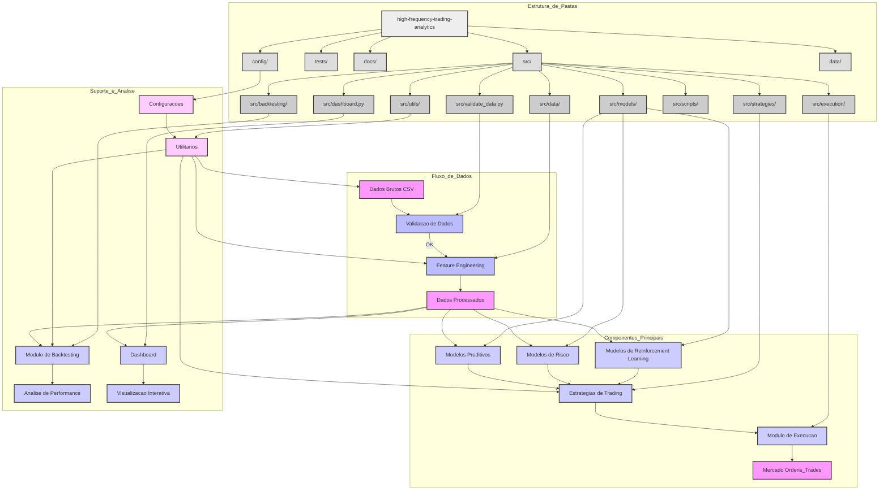

```mermaid
graph TD
    subgraph Fluxo_de_Dados
        A[Dados Brutos CSV] --> B[Validacao de Dados]
        B -- OK --> C[Feature Engineering]
        C --> D[Dados Processados]
    end

    subgraph Componentes_Principais
        D --> E[Modelos Preditivos]
        D --> F[Modelos de Risco]
        D --> G[Modelos de Reinforcement Learning]
        
        E --> H[Estrategias de Trading]
        F --> H
        G --> H
        
        H --> I[Modulo de Execucao]
        I --> J[Mercado Ordens_Trades]
    end

    subgraph Suporte_e_Analise
        D --> K[Modulo de Backtesting]
        K --> L[Analise de Performance]
        
        D --> M[Dashboard]
        M --> N[Visualizacao Interativa]
        
        O[Configuracoes] --> P[Utilitarios]
        P --> A
        P --> C
        P --> H
        P --> K
    end

    subgraph Estrutura_de_Pastas
        DIR_ROOT[high-frequency-trading-analytics]
        DIR_ROOT --> DIR_SRC[src/]
        DIR_ROOT --> DIR_TESTS[tests/]
        DIR_ROOT --> DIR_DOCS[docs/]
        DIR_ROOT --> DIR_CONFIG[config/]
        DIR_ROOT --> DIR_DATA[data/]

        DIR_SRC --> SRC_BACKTESTING[src/backtesting/]
        DIR_SRC --> SRC_DATA[src/data/]
        DIR_SRC --> SRC_EXECUTION[src/execution/]
        DIR_SRC --> SRC_MODELS[src/models/]
        DIR_SRC --> SRC_STRATEGIES[src/strategies/]
        DIR_SRC --> SRC_UTILS[src/utils/]
        DIR_SRC --> SRC_SCRIPTS[src/scripts/]
        DIR_SRC --> SRC_DASHBOARD[src/dashboard.py]
        DIR_SRC --> SRC_VALIDATE[src/validate_data.py]

        SRC_DATA --> C
        SRC_VALIDATE --> B
        SRC_DASHBOARD --> M
        SRC_BACKTESTING --> K
        SRC_MODELS --> E
        SRC_MODELS --> F
        SRC_MODELS --> G
        SRC_STRATEGIES --> H
        SRC_EXECUTION --> I
        SRC_UTILS --> P
        DIR_CONFIG --> O
    end

    style A fill:#f9f,stroke:#333,stroke-width:2px
    style B fill:#bbf,stroke:#333,stroke-width:2px
    style C fill:#bbf,stroke:#333,stroke-width:2px
    style D fill:#f9f,stroke:#333,stroke-width:2px
    style E fill:#ccf,stroke:#333,stroke-width:2px
    style F fill:#ccf,stroke:#333,stroke-width:2px
    style G fill:#ccf,stroke:#333,stroke-width:2px
    style H fill:#ccf,stroke:#333,stroke-width:2px
    style I fill:#ccf,stroke:#333,stroke-width:2px
    style J fill:#f9f,stroke:#333,stroke-width:2px
    style K fill:#ccf,stroke:#333,stroke-width:2px
    style L fill:#ccf,stroke:#333,stroke-width:2px
    style M fill:#ccf,stroke:#333,stroke-width:2px
    style N fill:#ccf,stroke:#333,stroke-width:2px
    style O fill:#fcf,stroke:#333,stroke-width:2px
    style P fill:#fcf,stroke:#333,stroke-width:2px

    style DIR_ROOT fill:#eee,stroke:#333,stroke-width:2px
    style DIR_SRC fill:#ddd,stroke:#333,stroke-width:2px
    style DIR_TESTS fill:#ddd,stroke:#333,stroke-width:2px
    style DIR_DOCS fill:#ddd,stroke:#333,stroke-width:2px
    style DIR_CONFIG fill:#ddd,stroke:#333,stroke-width:2px
    style DIR_DATA fill:#ddd,stroke:#333,stroke-width:2px
    style SRC_BACKTESTING fill:#ccc,stroke:#333,stroke-width:2px
    style SRC_DATA fill:#ccc,stroke:#333,stroke-width:2px
    style SRC_EXECUTION fill:#ccc,stroke:#333,stroke-width:2px
    style SRC_MODELS fill:#ccc,stroke:#333,stroke-width:2px
    style SRC_STRATEGIES fill:#ccc,stroke:#333,stroke-width:2px
    style SRC_UTILS fill:#ccc,stroke:#333,stroke-width:2px
    style SRC_SCRIPTS fill:#ccc,stroke:#333,stroke-width:2px
    style SRC_DASHBOARD fill:#ccc,stroke:#333,stroke-width:2px
    style SRC_VALIDATE fill:#ccc,stroke:#333,stroke-width:2px
```
